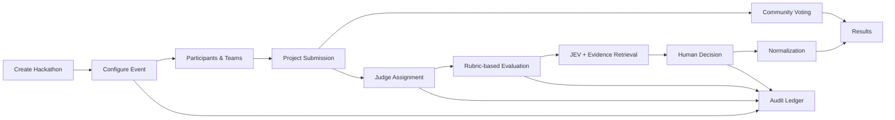
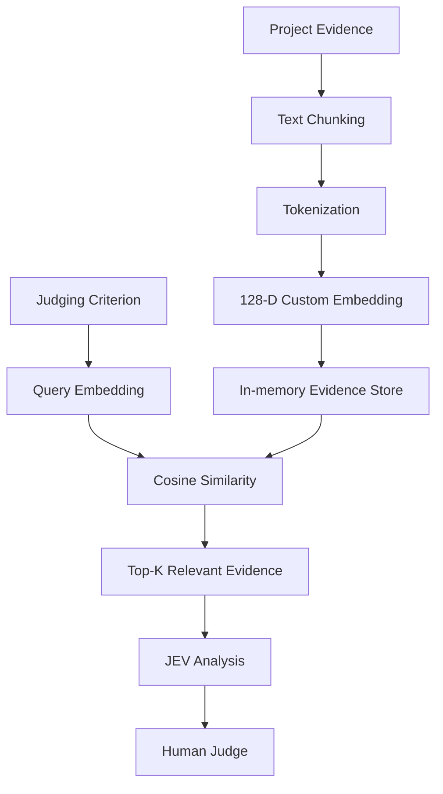
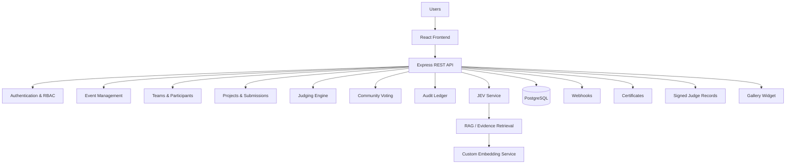
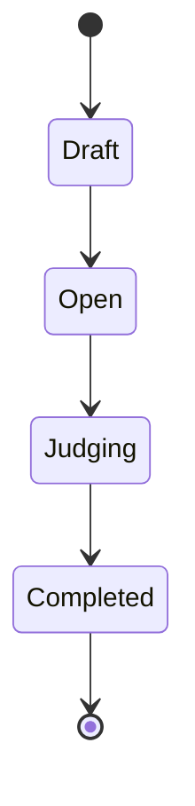

# 🦖 RaptorOS

### Open-source, self-hostable hackathon management platform

RaptorOS is a centralized hackathon management platform that manages the complete competition lifecycle — from **event creation and participant management to project submissions, judging, AI-assisted evidence analysis, community voting, auditability, and results**.

It is designed to give organizers, judges, and participants dedicated workflows while keeping the judging process structured, traceable, and human-controlled.

---

## ✨ What is RaptorOS?

Running a hackathon involves much more than collecting project submissions.

Organizers need to manage:

* Events and schedules
* Tracks and prizes
* Participants and teams
* Projects and submissions
* Judge assignments
* Rubrics and weighted criteria
* Evaluation and score normalization
* Community voting
* Audit records
* Certificates
* Integrations and webhooks

RaptorOS brings these workflows together in a single platform.

### Core workflow



---

## 🚀 Key Features

### 🏆 Event Management

* Create and manage hackathon events
* Configure event dates
* Configure event status
* Create tracks
* Define prizes
* Seeded demo event for immediate exploration

### 👥 Participant & Team Management

* Participant authentication
* Role-based access control
* Create teams
* Join teams using invite codes
* View team information
* Manage participant workflows

### 📁 Project Management

* Create and manage projects
* Associate projects with teams
* Assign projects to tracks
* Submit project versions
* Track submission status
* Public project gallery
* Repository and demo links

### ⚖️ Structured Judging

* Judge management
* Project-to-judge assignments
* Rubric configuration
* Weighted judging criteria
* Criterion-level scoring
* Multiple judge evaluations
* Judging completion tracking
* Score normalization
* Explain Score breakdown

### 🔎 JEV — Judge Evaluation Verification

RaptorOS includes a dedicated **Judge Evaluation Verification (JEV)** layer designed to assist judges with evidence-based evaluation.

JEV can:

* Retrieve evidence relevant to a judging criterion
* Show evidence sources
* Display evidence relevance
* Identify potential evidence concerns
* Provide context around an existing human score
* Analyze individual criteria
* Analyze the complete project
* Keep the final decision with the human judge

> **Human decision remains required. JEV is an assistive evaluation layer, not an autonomous judge.**

---

## 🧠 Retrieval-Augmented Evidence System

RaptorOS implements a lightweight custom retrieval pipeline to support JEV.

Project evidence can come from:

* Project description
* Project README / submitted content
* Technology-stack information

The retrieval pipeline works as follows:



### How retrieval works

1. Project evidence is divided into text chunks.
2. Each chunk is converted into a normalized **128-dimensional custom embedding**.
3. Embeddings are stored in an in-memory evidence store.
4. A judging criterion is converted into the same embedding representation.
5. Cosine similarity is calculated between the criterion query and indexed evidence.
6. The highest-relevance evidence chunks are retrieved.
7. JEV uses the retrieved evidence to generate criterion-specific observations and potential concerns.
8. The judge reviews the evidence and makes the final decision.

> **Implementation note:** RaptorOS currently uses a custom hashing-based embedding implementation and in-memory retrieval rather than an external embedding API or persistent vector database.

---

## 📊 Explain Score

RaptorOS provides transparent score breakdowns so judges and organizers can understand how an evaluation was calculated.

For each criterion, the system can show:

* Criterion name
* Weight
* Raw score
* Maximum score
* Weighted contribution
* Overall score

For example:

| Criterion       |   Weight | Raw Score | Contribution |
| --------------- | -------: | --------: | -----------: |
| Technical Depth |      30% |         8 |        24.00 |
| Innovation      |      25% |         9 |        22.50 |
| Impact          |      25% |         8 |        20.00 |
| Execution       |      20% |         9 |        18.00 |
| **Final Score** | **100%** |           |    **84.50** |

This makes the scoring process easier to inspect and verify.

---

## 🗳️ Community Voting

RaptorOS supports community voting for submitted projects.

Features include:

* Configurable voting window
* Enable/disable community voting
* Vote submission
* Vote removal
* Duplicate-vote prevention
* Rate limiting
* Hidden voting results
* Audit logging
* Participant-facing voting interface

Voting availability can be controlled by the event configuration.

---

## 🛡️ Role-Based Access Control

RaptorOS separates capabilities according to user roles.

| Role            | Main Capabilities                                         |
| --------------- | --------------------------------------------------------- |
| **Admin**       | Full platform administration                              |
| **Organizer**   | Event, participant, judging and operational management    |
| **Judge**       | Assigned project evaluation and evidence-assisted judging |
| **Participant** | Teams, projects and community voting                      |

Protected routes and API endpoints enforce role-based access rather than relying only on frontend navigation.

---

## 📋 Audit Ledger

RaptorOS maintains an audit ledger for important system and administrative actions.

The ledger records information such as:

* Actor
* Action
* Entity
* Event
* Timestamp
* Associated metadata

This provides a traceable history of important hackathon activity.

---

## 🔐 Integrity & Fairness

RaptorOS includes mechanisms intended to improve judging transparency and integrity:

* Judge/project assignments
* Multiple judge evaluations
* Weighted rubrics
* Score normalization
* Judge conflict tracking
* Evaluation completion tracking
* Audit logging
* Signed judge records
* Human-controlled final decisions

The **Control Room** provides organizers with an operational overview of judging progress and system integrity.

---

## 🧩 Additional Platform Capabilities

### Webhooks

Event webhooks can be created and monitored through the API.

Supported operations include:

* Create event webhook
* List event webhooks
* View webhook deliveries
* Record test deliveries

### Certificates

RaptorOS provides certificate issuing and verification APIs.

Certificates include a verification code that can be checked independently through the verification endpoint.

### Signed Judge Records

Judge records can be issued with cryptographic integrity information and verified through the API.

### Gallery Widget

RaptorOS provides an embeddable project gallery widget that exposes submitted project information for an event.

### CSV Import / Export

The platform supports CSV-based workflows including:

* Participant import
* Judging result export

---

## 🏗️ Architecture



---

## 🛠️ Tech Stack

### Frontend

* React
* Vite
* React Router
* Lucide Icons
* CSS

### Backend

* Node.js
* Express.js
* REST APIs
* JWT authentication
* Role-based authorization

### Database

* PostgreSQL

### AI / Evaluation

* Custom embedding-based evidence retrieval
* Cosine similarity
* JEV evidence analysis
* Criterion-level evaluation assistance

### Infrastructure

* Docker
* Docker Compose
* PostgreSQL container
* Node.js container

---

## 📂 Project Structure

```text
RaptorOS/
│
├── client/
│   ├── src/
│   │   ├── components/
│   │   ├── pages/
│   │   ├── context/
│   │   └── ...
│   └── ...
│
├── server/
│   ├── src/
│   │   ├── config/
│   │   ├── controllers/
│   │   ├── middleware/
│   │   ├── routes/
│   │   ├── services/
│   │   └── app.js
│   ├── Dockerfile
│   └── package.json
│
├── database/
│   ├── schema.sql
│   ├── seed.sql
│   └── migrations/
│
├── docker-compose.yml
└── README.md
```

---

## ⚡ Getting Started

### Prerequisites

Make sure you have:

* Docker
* Docker Compose
* Git

No local PostgreSQL installation is required when using the provided Docker Compose setup.

### 1. Clone the repository

```bash
git clone https://github.com/Muskanmulani/RaptorOS.git
cd RaptorOS
```

### 2. Start the backend and database

```bash
docker compose up --build
```

The backend will be available at:

```text
http://localhost:5000
```

The API health endpoint is:

```text
http://localhost:5000/api/health
```

### 3. Start the frontend

Open a second terminal:

```bash
cd client
npm install
npm run dev
```

The frontend will normally be available at:

```text
http://localhost:5175
```

---

## 🌱 Seeded Demo Event

RaptorOS includes a seeded **RaptorOS Demo Hackathon** so the platform can be explored immediately after setup.

The seeded environment includes:

* Demo event
* Tracks
* Prizes
* Participants
* Teams
* Projects
* Judges
* Judging configuration

### Demo accounts

All demo accounts use:

```text
Password: RaptorOS@123
```

| Role        | Email                        |
| ----------- | ---------------------------- |
| Admin       | `admin@raptoros.local`       |
| Organizer   | `organizer@raptoros.local`   |
| Judge       | `judge1@raptoros.local`      |
| Judge       | `judge2@raptoros.local`      |
| Participant | `participant@raptoros.local` |

> **For local/demo use only. Change credentials and secrets before using RaptorOS in a real environment.**

---

## 🎯 Suggested Demo Workflow

After starting RaptorOS:

```text
Landing Page
     ↓
Organizer Login
     ↓
Demo Hackathon
     ↓
Participant & Teams
     ↓
Project Gallery
     ↓
Judge Login
     ↓
Assigned Project
     ↓
Rubric-based Evaluation
     ↓
Evidence Retrieval
     ↓
Explain Score
     ↓
Control Room
     ↓
Community Voting
     ↓
Audit Ledger
```

This demonstrates the major end-to-end workflow of the platform.

---

## 🔌 API Overview

RaptorOS exposes REST APIs for the major platform workflows.

Examples include:

```text
/api/auth
/api/events
/api/projects
/api/judging
/api/jev
/api/voting
/api/webhooks
/api/certificates
/api/gallery-widget
/api/import
```

### JEV endpoints

```text
POST /api/jev/project/:projectId/index
GET  /api/jev/project/:projectId/search
GET  /api/jev/project/:projectId/analyze
GET  /api/jev/project/:projectId/criterion/:criterionId
```

These endpoints are protected by authentication and role-based authorization.

---

## 🔄 Event Lifecycle



The event lifecycle allows organizers to manage the competition from initial configuration through final judging and completion.

---

## 🧪 Example Judging Flow

A typical evaluation can look like:

```text
Project: EcoRoute

Technical Depth     → 8/10
Innovation          → 9/10
Impact              → 8/10
Execution           → 9/10

Weighted Score      → 84.50
```

JEV can then retrieve evidence related to each criterion and present it to the judge for verification.

The judge remains responsible for the final evaluation.

---

## 🔒 Security Considerations

RaptorOS implements:

* JWT-based authentication
* Role-based authorization
* Protected API routes
* Rate limiting for voting/comment workflows
* Duplicate-vote prevention
* Audit logging
* Signed judge records
* Environment-based database configuration

For production deployments, additional hardening should be applied, including secure secret management, HTTPS, production credentials, persistent evidence storage, monitoring, and infrastructure-level security controls.

---

## 🚧 Current Implementation Notes

RaptorOS is designed as an open-source, self-hostable hackathon management platform.

Current implementation choices include:

* PostgreSQL for persistent application data
* Docker Compose for local/self-hosted setup
* Custom lightweight embeddings for evidence retrieval
* In-memory evidence indexing for JEV
* Human-in-the-loop judging
* Client-side project ordering for the current participant experience

These choices keep the platform lightweight while leaving room for future production-scale improvements.

---

## 🔮 Future Improvements

Potential future extensions include:

* Persistent vector storage
* Production-grade embedding models
* Semantic search infrastructure
* Server-side project randomization
* Advanced analytics dashboards
* Automated notification systems
* More integrations
* Production deployment templates
* Enhanced certificate customization
* Expanded judge calibration tools

---

## 🤝 Contributors

Built by:

* **Muskan Mulani**
* **Zoha Shaikh**

RaptorOS was developed as an open-source hackathon platform focused on making hackathon operations more structured, transparent, and manageable.

---

## 📜 License

This project is open source. See the repository license for the applicable terms.

---

## ⭐ Why RaptorOS?

RaptorOS brings the entire hackathon workflow into one system:

**Events → Teams → Projects → Judging → Evidence → Decisions → Voting → Auditing → Results**

Instead of managing these workflows across disconnected tools, RaptorOS provides a centralized platform with role-based workflows, structured evaluation, evidence-assisted judging, and an auditable competition lifecycle.

---

<p align="center">
  <strong>🦖 RaptorOS</strong><br>
  <em>Run hackathons. Structure judging. Keep decisions human.</em>
</p>
s